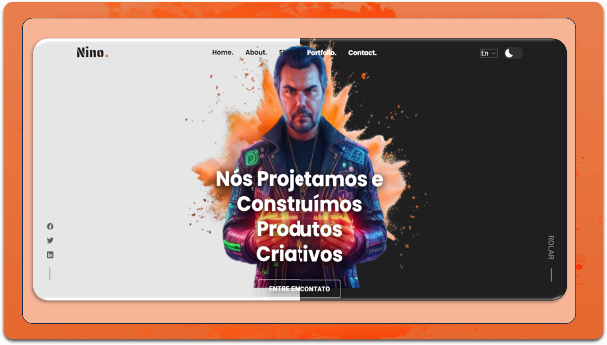

<div align="center">
  
  
  
  

  <br />
  <br />
  
  

  <h2 align="center">Nino - Personal portfolio</h2>

This website is fully responsive personal portfolio, <br />Responsive for all devices, built using HTML, CSS, and JavaScript.

<a href="https://portfolio-geral-1.vercel.app" target="_blank"><strong>➥ Live Demo</strong></a>

</div>

<br />

### Demo Screeshots



### Prerequisites

Before you begin, ensure you have met the following requirements:

- [Git](https://git-scm.com/downloads "Download Git") must be installed on your operating system.

### Run Locally

To run **Nino-portfolio** locally, run this command on your git bash:

Linux and macOS:

```bash
sudo git clone https://github.com/gessnerbezerra/portfolio-geral-1.git
```

Windows:

```bash
git clone https://github.com/gessnerbezerra/portfolio-geral-1.git
```

### Technical information

<a href="./Portifolio_pessoal.pdf" target="_blank"><strong>➥ technical document</strong></a>
